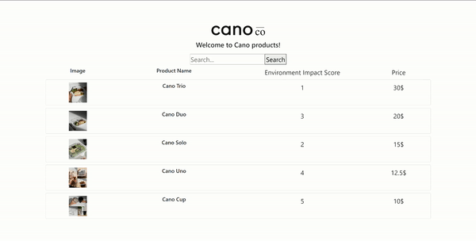

# Welcome to Cano Products App

This is a demo project for Cano Products App. It displays all available Cano products, and allows you to see the product details, environment impact and the price of each one.

Website: https://yuchenhemtl.github.io/cano-products

## Demo


## Getting Started

In the project directory, run 
```
npm install 
npm start
```

to start a local instance of the web app. You can also check out the website [here](https://yuchenhemtl.github.io/cano-products/).

## Features

The app displays all available products, and the user can click on individual table column names to sort them alphabetically and numerically. 
The user can also search a particular product using the search bar.
